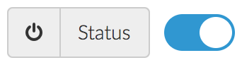

# laravel-toggle-switch-button
A customizable and configurable toggle switch button generator for Laravel that enables you to simply display it on your projects pages.



------------------------------------------------------------------------------------------------------------------------

## Installation

1. Install the package with composer :
```
composer require laravel-toggle-switch-button
```
2. Add the package service provider in the `register()` method from your `app/Providers/AppServiceProvider.php` :
```
// laravel toggle switch button
// https://github.com/Okipa/laravel-toggle-switch-button
$this->app->register(Okipa\LaravelToggleSwitchButton\ToggleSwitchButtonServiceProvider::class);
```
3. Add the facade of this package to the $aliases` array of the from your `config/app.php` file :
```
'ToggleSwitchButton'  => Okipa\LaravelToggleSwitchButton\Facades\ToggleSwitchButton::class,
```
4. Load the package `CSS` or `SASS` file from the `[path/to/composer/vendor]/okipa/laravel-toggle-switch-button/styles` directory to your project.

------------------------------------------------------------------------------------------------------------------------

## Usage
Simply call the toggle switch button rendering in your form as precised in the following example :
```
{!! ToggleSwitchButton::render(
    'active',
    old('active'),
    '<i class="fa fa-power-off" aria-hidden="true"></i>',
    'Status'
) !!}
```

**Parameters :**
1. (required) ***string*** $input_name : set the input name. Also used by default for the input id.
2. (optional) ***bool*** $input_checked : determine whether your toggle switch button is checked or not.
3. (optional) ***string*** $label_icon : set the icon that will appear before the toggle switch button.
4. (optional) ***string*** $label_string : set the label that will appear before the toggle switch button.
5. (optional) ***string*** $label_id : set the input id. If not filled, the input name will be used.

------------------------------------------------------------------------------------------------------------------------

## Customize styles
If you use `CSS`, just override the package styles.

If you use `SASS`, you can override the following variables **before** the package SASS file import. Check the following example for a bootstrap use :
```
$toggle_switch_button_label_background_color: $input-group-addon-bg; // default #eeeeee
$toggle_switch_button_label_border-color: $input-group-addon-border-color; // default #ccc
$toggle_switch_button_label_font-size: $font-size-small; // default inherit
$toggle_switch_button_unchecked_background-color: $input-group-addon-border-color; // default #ccc
$toggle_switch_button_checked_background-color: $brand-primary; // default #337ab7
$toggle_switch_button_border_radius: $btn-border-radius-base; // default 4px
```

------------------------------------------------------------------------------------------------------------------------

## Customize templates
Publish the package blade templates file in your project :
```
php artisan vendor:publish --tag=toggle-switch-button::views
```
Then, change the content from your `resources/views/vendor/toggle-switch-button/switch-button.blade.php` file.  